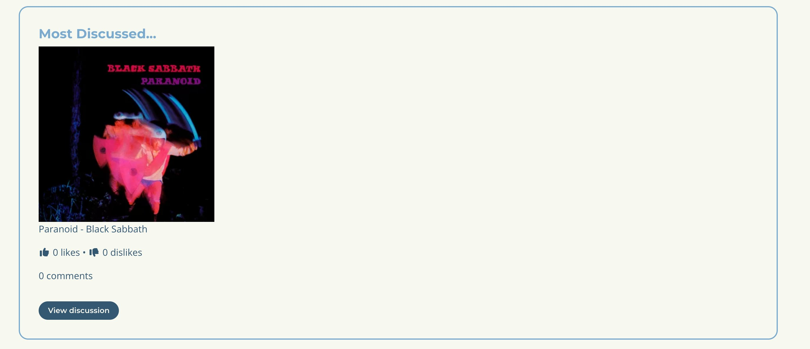

# Music Madness


## Table of Contents

1. [UX](#ux)
    - [Project Goals](#project-goals)
    - [User Goals](#user-goals)
    - [User Stories](#user-stories)
    - [Developer Goals](#developer-goals)
    - [Design Choices](#design-choices)
        - [Colour Pallete](#colour-pallete)
        - [Frontend Design (Canva)](#frontend-design-canva)
            - [Home Page](#home-page)
            - [About Page](#about-page)
            - [Genre Page](#genre-page)
            - [Explore Page](#explore-page)
            - [Album Discuss Page](#album-discussion-page)
            - [Login Page](#login-page)
            - [Signup Page](#signup-page)
        - [Wireframes](#wireframes)
            - [Mobile](#mobile)
            - [Tablet](#tablet)
            - [Desktop](#desktop)
        - [ERD](#erd)
2. [Features](#features)
    - [Existing Features](#existing-features)
    - [Features to Implement](#features-to-implement)
3. [Technologies Used](#technologies-used)
4. [Testing](#testing)
    - Code Validation
    - [Bugs Discovered](#bugs-discovered)
    - Manual Testing
    - Automated Testing
5. [Deployment](#deployment)
    - [How To Run The Project Locally](#how-to-run-the-project-locally)
6. [Credits](#credits)
    - [Content](#content)
    - [Code](#code)
    - [Images](#images)
    - [API](#api)
    - [Acknowledgements](#acknowledgements)

## Introduction

**Music Madness** is a community-driven web application where metal fans can explore albums, react to releases, and join discussions around their favourite music.

The platform focuses on conversation over ratings, giving users a space to share opinions, debate iconic records, and discover new music across multiple genres. From classic heavy metal to modern subgenres, Music Madness brings together fans who want more than just a score — they want a voice.

---

# UX


## Project Goals

The goal of **Music Madness** is to build a full-stack web app where users can explore albums, share their opinions, and get involved in discussions around music. The focus is on creating something interactive rather than just a simple rating platform.

The project uses Django and PostgreSQL to handle the backend, with a database designed around albums, genres, users, and interactions. On the frontend, the aim is to bring custom designs to life with a consistent and responsive layout.

Users will be able to create accounts, react to albums, and leave comments, making the experience more personal and community-driven. The project is also structured in a way that makes it easy to expand later on.

---

## User Goals

Users of **Music Madness** should be able to easily discover new albums, revisit favourites, and share their opinions with others who enjoy the same kind of music. The goal is to give people a space where they can do more than just rate an album — they can actually talk about it.

A user should be able to browse albums by genre, view album details, and see how others in the community feel about a release. They should also be able to react to albums and leave comments, making it easy to join ongoing discussions or start their own.

The overall experience should feel simple and intuitive, so users can quickly find what they’re looking for and get involved without any friction.

---

## User Stories

Users should be able to browse through albums so they can find new music or go back to ones they already like. They should be able to click into an album and see details like the artist, tracklist, and what other people think about it.

Users should be able to sign up and log in so they can take part in the site. Once they’re logged in, they should be able to like or dislike albums and leave comments to share their opinions.

They should also be able to read other people’s comments, so they can see different views and join in on discussions around each album.

It should also be easy to explore albums by genre, so users can quickly find music that matches what they’re into. Overall, the site should feel simple to use and easy to navigate without having to think too much about it.

---

## Developer Goals

The goal for this project is to build a full-stack web app that connects a Django backend with a custom frontend, rather than just following a basic tutorial. I want to get comfortable working with models, views, and templates together so the site actually feels dynamic.

Another aim is to design and implement a relational database based on an ERD, making sure everything is structured properly and makes sense as the project grows. This includes handling relationships between albums, genres, users, and interactions like comments and reactions.

I also want to improve my ability to turn a UI design into a working application, keeping the layout consistent and responsive across different pages.

On top of that, the project is about getting more confident working with external APIs, managing data, and organising the codebase into separate Django apps so it stays clean and scalable.

Overall, the focus is on building something that works end-to-end and feels like a real product, not just a collection of features.

---

# Design Choices

## Colour Pallete

The colour palette was chosen to reflect the aesthetic of metal music — dark, bold and high contrast. A deep navy background gives the site its heavy, underground feel while keeping everything readable. Bright accent colours are used sparingly to draw attention to the most important interactive elements like buttons, reaction counts and call-to-action banners, so users always know where to focus. The palette stays consistent across every page so the site feels like a cohesive product rather than a collection of separate screens.


## Frontend Design (Canva)

All pages were designed in Canva before development began. Having a finished visual reference for each page meant design decisions were made upfront rather than during coding, which kept the build focused and consistent.

### Home Page


The home page design opens with a dark navy hero card containing the tagline "Where Metalheads Rate The Riffs." and a short subheading, with two pill-shaped buttons — "Join the pit" and "Explore Albums" — side by side. The hero was designed to immediately communicate what the site is and give the user two clear options: join or browse. These buttons only show to logged-out users, which was a deliberate choice to avoid presenting existing members with actions they've already taken.

Below the hero, three dark feature cards — "React to albums", "Join the discussion", and "Track community opinion" — sit in a row, each with a short one-line description. These were designed to quickly communicate the three core things the platform offers without requiring the user to read anything long. Keeping them as cards with bold headings means users can scan the value proposition in seconds.

The "Inside the Pit" section follows, showing three real album cards — Black Sabbath's Paranoid, Metallica's The Black Album, and Ozzy Osbourne's Blizzard of Ozz — each with cover art, artist name, album title, genre tag, live like and dislike counts, and a "View discussion" button. Showing real albums and real community numbers here rather than placeholder content was an intentional design decision to make the site feel active and lived-in from the very first visit.

A "Browse by genre" section with six rounded pill buttons — Rock, Heavy Metal, Alternative Rock, Thrash, Death Metal, Metalcore — provides direct routes to each genre page. At the bottom, a large "STEP INTO THE PIT" banner with two wide CTA buttons encourages non-members to sign up, and disappears once a user is logged in. The footer sits beneath with the logo, tagline and quick links on the right.

### About Page


The about page was designed with the same card-based structure as the rest of the site to keep it visually consistent even on a page that is mostly text. The hero card at the top carries the site name, a two-sentence description of the platform, and the tagline "Where metalheads rate the riffs." as a bold centred line. This repetition of the tagline was intentional — it reinforces the site's identity for anyone who arrives on the about page without having seen the home page.

Below the hero, a "What is Music Madness?" card uses a cream/off-white background to visually separate it from the hero, with two short paragraphs explaining the platform's purpose in plain language. The deliberate use of a lighter background card here breaks up the page visually and signals a shift from branding to information.

A "How it works" card follows with three dark inner cards — "React to albums", "Join the discussion", and "Discover new music" — mirroring the structure used on the home page. Using the same three-card pattern here reinforces the message and feels familiar rather than repetitive. A "STEP INTO THE PIT" call-to-action banner at the bottom rounds off the page with the same two CTAs as the home page, keeping the conversion opportunity consistent across the site.

### Genre Page


The genre page design gives each genre a strong identity through a dedicated dark hero card at the top showing the genre name as a large centred heading — "Heavy Metal" in this case — with a one-line description and a live count of albums and discussions ("24 albums • 132 discussions"). This count was included by design to give the page an immediate sense of scale and activity before the user starts scrolling.

Below the hero, a search bar on the left and a "Sort by: Most Discussed" dropdown on the right sit on the same row, keeping the filtering tools visible and accessible without any extra clicks. Placing them directly above the album grid means a user can filter or sort without losing their place in the page.

The album grid uses three columns at desktop width, showing six albums per screen — Black Sabbath, Ozzy Osbourne, Judas Priest, Iron Maiden, Dio, and Motörhead in the design. Each card shows the album cover art prominently at the top, followed by the artist name in bold, the album title, genre tag, like and dislike counts with thumbs icons, and a rounded "View discussion" button. The card design was kept consistent with the featured album cards on the home page so the pattern is immediately familiar, reducing the learning curve for returning users.

### Explore Page


The explore page was designed as the site's discovery hub for users who are not sure where to start. The hero card at the top shows "Explore Albums" as the page heading with a short description and the site-wide stats — "124 albums • 562 discussions" — displayed as a single line. Showing live numbers here rather than just a heading was a deliberate decision to reinforce the sense of an active, growing community.
 
The "Trending in the pit..." section below shows three album cards in the same format as the home page, surfacing featured content for users who want a recommendation rather than browsing by genre. Directly below that, the "Most Discussed..." section gives one album — Blizzard of Ozz by Ozzy Osbourne — a larger treatment: the cover art sits large on the left, with the title, artist, likes, dislikes and comment count displayed in bold text to the right, plus a "View discussion" button. This bigger format was chosen to give the most active album on the site the prominence it earns, and to give users a different visual rhythm from the three-column card grid above.
 
A "Browse by Genre..." section at the bottom provides the same six genre pill buttons as the home page, completing the page's role as a central navigation point for users who want to explore in any direction.

### Album Discussion Page


The album detail page design is the most information-dense page on the site and was structured to give users everything they need in a logical reading order. The header section at the top is a dark card combining the album cover art on the left with the key metadata on the right: artist name, album title, genre, release year, a description pulled from Last.fm, live like and dislike counts, and a "Like" and "Dislike" button. Grouping all of this together in a single card means users immediately have the full picture before scrolling into the discussion below.
 
Directly beneath the header, still within the same card, is the "Community Reaction" section: a percentage bar showing "80% liked this album" with the filled and unfilled segments clearly visible, and a line showing the most mentioned tracks. This bar was designed to give an instant visual summary of community sentiment that requires no reading — a user can see at a glance whether an album is well-regarded or divisive, which is one of the key pieces of social information the site exists to provide.
 
Below the header card, the "Discussion" section opens with a prominent text area — "Share your thoughts on this album:" — and a "Post Comment!" button. Placing the comment form above the existing comments was a deliberate design choice to encourage participation before reading, since users who see an empty-looking form above a list of comments are more likely to contribute than users who scroll past a long thread first.
 
Comment cards below each show the username, timestamp, comment text and a like count with a reply link. The consistent card styling with a cream background and a rounded border keeps each comment visually contained and easy to read. A "You might also like..." section at the bottom shows three related album covers from the same genre, keeping users engaged with the site rather than leaving once the discussion ends.

### Login Page


The login page design centres a single off-white card on a light background, with "Welcome back" as the heading and a short line explaining what logging in unlocks — "Sign in to react to albums, join discussions, and connect with other metal fans." The heading and the reminder of what awaits were chosen to make the login feel warm and purposeful rather than purely transactional.
 
The form itself has just two fields: an email address input and a password input, both with rounded styling that matches the pill aesthetic used across the site. A full-width "Log in" button in the site's muted blue sits below the fields, making it impossible to miss. Two helper links follow — "Don't have an account? Join the pit" and "Forgot Password?" — both using the site's blue accent colour so they are visible without competing with the primary button. The phrase "Join the pit" was used intentionally to keep the site's tone consistent even on a utility page. The light footer with the Music Madness logo and navigation links completes the page.

### Signup Page


The signup page mirrors the login layout with the same centred off-white card, keeping the two pages visually consistent so users moving between them always feel oriented. The heading "Create your account" is followed by a motivational subheading — "Join the community already discovering new music, reacting to albums and sharing their thoughts throughout the metal community." — which was designed to frame account creation as joining something rather than filling in a form.
 
The form has four fields: Username, Email address, Password, and Confirm password. Inline helper text appears below the username and password fields — "Must contain 8 characters. Only -, &, ! are allowed." — which was included in the design to surface validation requirements before submission rather than after an error, reducing frustration. A full-width "Create Account" button sits below the fields, and a final link — "Already have an account? Step into the pit" — provides a route back to login. The use of "Step into the pit" rather than plain "Log in" keeps the community-first language consistent even at the point of account creation.

---

## Wireframes

Each page was wireframed across mobile, tablet and desktop breakpoints before the Canva designs were created. The wireframes focused purely on layout and content hierarchy — where each section sits, how much space it takes up, and how that structure changes at different screen sizes. Working through all three breakpoints at the wireframe stage meant responsive behaviour was planned from the start rather than retrofitted after the fact.

### Mobile


### Tablet


### Desktop


--- 

## ERD


---

# Features

## Existing Features

## Navigation

The navbar keeps things simple across every page. The Music Madness logo on the left takes you back to the home page, and the links on the right give you access to Explore, Genres, About and the login options. The Genres link opens a dropdown where you can jump straight to any of the six genre pages. A Home link shows up in the navbar on every page except the home page itself — no need to show it when you're already there. If you're not logged in you'll see Login and Sign Up buttons. Once you're in, those are replaced with your username and a Logout button. On mobile the links tuck away behind a hamburger menu so everything stays accessible without crowding the screen.

---

## Home Page

The home page is the first thing visitors see, so it's designed to get people interested quickly. There's a hero section at the top with the site tagline and a couple of buttons to get started. The "Join the pit" and "Explore Albums" buttons only show up if you're not logged in — no point showing them to someone who's already a member. Below that, three cards explain what the site is about: reacting to albums, joining discussions and seeing what the community thinks. The "Inside the Pit" section shows three albums chosen by the admin, each with the cover art, artist, title, genre, current like and dislike counts, and a link to the discussion. There's also a "Browse by Genre" section with buttons for each genre, and a "Step into the Pit" banner at the bottom encouraging new visitors to sign up. That banner disappears once you're logged in.

---

## Explore Page

The Explore page is a good starting point if you're not sure where to go. It shows you how many albums are in the database and how many discussions have happened across the site. The "Trending in the Pit" section shows three featured albums, and "Most Discussed" highlights one album in a bigger format with its like count, dislike count and number of comments. At the bottom there are genre buttons to take you wherever you want to go next.

---

## Genre Pages

Each genre has its own page with a full list of albums. The hero at the top shows the genre name, a short description, and how many albums are in there. You can search for a specific album or artist using the search bar, and sort the results by artist or title. Every album in the genre shows up as a card with the cover art, artist, title, genre tag, like and dislike counts, and a button to go to the discussion page.

---

## Album Detail Page

This is the main page of the site where everything comes together. At the top you get the full album info — cover art, artist, title, genre, release year if we have it, and a description pulled from Last.fm. If you're logged in you can like or dislike the album. The button you've picked stays highlighted so you always know where you stand. Clicking the same one again removes your reaction, and clicking the other one switches it. The Community Reaction bar underneath shows what percentage of people have liked the album based on all the reactions so far. There's also a tracklist you can expand to see all the tracks with their durations.

Below all of that is the discussion section. Logged in users can post a comment and reply to other people's comments. If it's your comment you can edit it right there on the page without going anywhere, or delete it if you want. Logged out users just see a prompt to log in. At the very bottom there are three related albums from the same genre in case you want to keep exploring.

---

## User Authentication

Authentication is handled by django-allauth. Signing up just needs a username, email and password. Logging in uses your email and password. There's a logout confirmation page so you don't accidentally sign yourself out. Once you're logged in your username shows up in the navbar and you get access to all the interactive parts of the site — reacting to albums, posting comments, editing and deleting your own contributions.

---

## Music Data

The site has over 300 albums across six genres, all pulled in from the Last.fm API. Each album has a title, artist, genre, cover artwork, description and a tracklist with track durations. The data comes in through a custom management command called `fetch_albums` which queries Last.fm by artist and grabs their top albums. Admins can mark albums as featured from the admin panel to control what shows up in the "Inside the Pit" and "Trending" sections.

---

## Admin Panel

The admin panel uses the Jazzmin theme so it looks a bit more presentable than the Django default. From there you can manage everything — genres, albums, tracks, reactions and comments. Albums have a featured checkbox you can toggle straight from the list without having to open each one. Comments can be searched by username, album or content, and you can delete them individually or in bulk if needed.

---

## Footer

The footer sits at the bottom of every page with the Music Madness logo, the site tagline, and quick links to About, Explore and Login.


---

## Features To Implement

These are features that were considered during the planning phase of Music Madness but were ultimately outside the scope of this project. They are logged as "Won't have" issues on the GitHub board and could be revisited in a future version of the site.

---

## User Profiles

It would be good to give each user their own profile page showing their activity on the site — which albums they've liked or disliked, comments they've left, and maybe some stats about their taste in music. For now users just have a username that shows up on their comments, but a proper profile page would make the community feel more personal and give people a reason to engage more.

---

## Following Other Users

Linked to profiles, the idea of following other users was something that came up early on. If you could follow someone whose taste you rate, you'd be able to see what they've been reacting to or commenting on. It's a nice social feature but it adds a fair amount of complexity and wasn't essential for the core experience of the site.

---

## Album Rating with Stars

A star rating system on top of the existing like/dislike reactions was considered as a way to give users more nuance in how they express their opinion. A five star scale would let someone say "this is decent" without committing to a full like, or give a legendary album the credit it deserves. It was left out because the like/dislike system covers the basics well enough for now, and adding stars would have needed more thought around how to display and aggregate the scores.

---

## Playlist Creation

The ability to build your own playlists from albums on the site was an idea that would have added a personal collection element to Music Madness. Users could group their favourite albums together and share them with the community. It's a solid feature for a future version but would require a decent amount of extra data modelling and UI work to do properly.

---

## Music Playback Integration

Integrating a music playback feature — for example connecting to the Spotify or Last.fm API to let users preview tracks directly on the album page — was considered but ruled out early. Spotify's API restrictions for playback require a premium account and additional OAuth setup that was beyond the scope of this project. It would be a great addition in the future if the right API access was available.

---

## Vinyl or CD Wishlist

A wishlist feature where users could mark albums they want to own on vinyl or CD was a fun idea that came out of the metal community theme of the site. It would give users another way to interact with the album catalogue beyond just reacting and commenting. It was left out as a "nice to have" given the other priorities, but it would fit well with the collector mentality of a lot of metal fans.

---

# Technologies Used

## Languages

**Python** was used for all backend logic, views, models and management commands. It's the language Django is built on and handles everything from database queries to API calls.

**HTML** makes up the structure of every page on the site, written as Django templates which allow dynamic content to be injected from the backend.

**CSS** handles all the styling across the site. A single custom stylesheet was written from scratch using the project's colour palette to give Music Madness its own consistent look and feel.

**JavaScript** was used for small interactive elements on the frontend, specifically the reply toggle functionality in the comments section and the mobile navbar behaviour.

---

## Frameworks and Libraries

**Django 4.2** is the main web framework the project is built on. It handles URL routing, views, templates, the ORM, authentication and the admin panel.

**Bootstrap 5** was used for the responsive grid layout and utility classes. It handles the column structure across the site and powers the collapsible navbar on mobile.

**django-allauth** handles all user authentication including sign up, login and logout. It was chosen because it's well maintained, secure and easy to customise with custom templates.

**Whitenoise** is used to serve static files in production on Heroku. It compresses and caches static assets so they load efficiently without needing a separate CDN.

**dj-database-url** is used to parse the database connection URL provided by Heroku, allowing the same settings file to work both locally and in production.

**Font Awesome** provides the icons used throughout the site, including the thumbs up and down icons on album cards and the music icon on the tracklist toggle.

**Google Fonts** provides the two typefaces used across the site — Montserrat for headings and navigation, and Open Sans for body text.

---

## Database

**PostgreSQL** is used as the database in both local development and production. It was set up on Heroku using their managed PostgreSQL add-on, and connected locally using the same database URL to keep both environments in sync.

---

## Admin

**Jazzmin** is a custom Django admin theme that replaces the default admin interface with a more polished dark-themed UI. It was configured with Music Madness branding, a custom welcome message and a dark colour scheme.

---

## External APIs

**Last.fm API** was used to import all the album and track data into the database. A custom Django management command called `fetch_albums` queries the Last.fm API by artist name and pulls in album titles, descriptions, cover artwork URLs and full tracklists. The API key is stored as an environment variable and never committed to the codebase.

---

## Hosting and Deployment

**Heroku** is used to host the live version of the application. The project is deployed directly from GitHub using the Heroku CLI, and environment variables including the secret key, database URL and API keys are managed through Heroku's config vars.

**GitHub** is used for version control throughout the project. Code was committed regularly with descriptive messages, and the repository is used as the source for Heroku deployments.

---

## Design and Planning

**Canva** was used to create the frontend designs and wireframes for the site before any code was written. All page layouts including the home page, genre pages, album detail page, explore page, about page, login and signup pages were designed in Canva first and used as a reference throughout development.

**Lucidchart** was used to design the Entity Relationship Diagram (ERD) for the database. The ERD was created during the planning phase and used as a reference when building the Django models, ensuring the database structure was thought through before implementation.

# Testing

## Code Validation

## Bugs Discovered

This section documents bugs encountered during the development of Music Madness, including screenshots, descriptions, and how each was resolved.

---

## Bug 1 — Duplicate and Remastered Albums Appearing on Homepage

**Description:**
When album data was first imported from the Last.fm API using the fetch_albums management command, the homepage "Inside the Pit" section displayed duplicate entries and remastered versions of albums alongside the originals. All three cards showed Black Sabbath albums, including "Paranoid (2009 Remastered Version)" as a separate entry. Additionally, two album cards (Metallica and Ozzy Osbourne) had broken images as Last.fm returned no cover art for those entries.


**Cause**
The `fetch_albums` command used `artist.gettopalbums` from Last.fm which returned remastered and deluxe editions as separate albums. The homepage view was also using `Album.objects.all()[:3]` which simply returned the first three database entries rather than a varied selection.

**Fix:**
- Added a keyword filter to the fetch command to skip remastered/deluxe editions:
```python
keywords = ['remaster', 'deluxe', 'edition', 'anniversary', 'bonus']
if any(kw in album_title.lower() for kw in keywords):
    continue
```
- Added a `featured` boolean field to the `Album` model, allowing specific albums to be manually selected in the Django admin panel
- Updated the homepage view to filter by `featured=True`

---

## Bug 2 - About Page CSS Is Not Displaying

**Description:**
After building the about page, the CSS styles were not being applied. The page rendered as plain unstyled text — no dark blue hero card, no bordered content cards, and no styled "How it works" section.


**Cause**
The browser was serving a cached version of `style.css` that did not include the newly added about page styles.

**Fix**
Running `python manage.py collectstatic` forced Django to serve the latest version of the stylesheet. A hard browser refresh (`Cmd + Shift + R`) cleared the cached version and the styles applied correctly.

---

## Bug 3 - Genre Page Returning 404

**Description:**
Navigating to `/genres/heavy-metal/` returned a 404 Page Not Found error. Django listed only three URL patterns (`admin/`, `home`, `about/`) and could not match the genre URL.


**Cause**
The `urls.py` file had not been updated to include the `genre_detail` URL pattern. The genre detail view and its URL route had been written but not yet added to `urlpatterns`.

**Fix:**
Added the genre detail URL pattern to `music_madness/urls.py`:
```python
path('genres/<slug:slug>/', genre_detail_view, name='genre_detail'),
```
And imported the view:
```python
from albums.views import home_view, about_view, genre_detail_view
```
 
---

## Bug 4 - Genre Page Hero Section CSS Not Applying

**Description:**
After implementing the genre detail page, the hero section appeared as plain unstyled text on a white background. The dark blue rounded card styling defined by `.genre-hero` in `style.css` was not being applied despite the class being present in the HTML. Inspecting the element in Chrome DevTools confirmed "No matching selector or style" for `.genre-hero`.


**Cause**
The browser was loading a cached version of `style.css` that predated the genre styles being added.

**Fixed**
Running the following command forced Django to regenerate and serve the updated stylesheet:
```bash
python manage.py collectstatic --clear
```
 
---

## Bug 5 — Database Migration Failure When Adding Slug Field to Genre
 
**Description:**
Running `python manage.py migrate` after adding a `slug` field to the `Genre` model failed with a `UniqueViolation` error. The migration attempted to create a unique index on the slug column but all existing genres had empty slug values, causing a duplicate key violation.
 
**Cause:**
The migration tried to add the `slug` field with `unique=True` in a single step. Since existing genre records all had empty slugs, PostgreSQL could not create a unique index on a column full of identical empty strings.
 
**Fix:**
The migration file `0005_genre_slug.py` was rewritten as a three-step operation:
1. Add the slug column without the unique constraint
2. Run a data migration (`RunPython`) to populate slugs for all existing genres using `slugify(genre.name)`
3. Alter the field to add the unique constraint
```python
operations = [
    migrations.AddField(
        model_name='genre',
        name='slug',
        field=models.SlugField(blank=True, default='', unique=False),
    ),
    migrations.RunPython(populate_slugs),
    migrations.AlterField(
        model_name='genre',
        name='slug',
        field=models.SlugField(blank=True, unique=True),
    ),
]
```

---

## Bug 6 - Most Discussed Section Info Not Displaying

**Description:**
After building the explore page, the "Most Discussed" section only showed the album cover image on the left with no title, stats or "View discussion" button appearing beside it. The right side of the card was completely empty despite the correct HTML being in place.


**Cause:**
Inspecting the element in Chrome DevTools revealed that the `.most-discussed__info` div was rendering as empty in the DOM. The CSS for `.most-discussed__info` was showing "No matching selector or style" in the Styles panel, meaning the browser was still serving a cached version of `style.css` that did not include the new explore page styles.

**Fix:**
Running `python manage.py collectstatic --clear` forced Django to regenerate the stylesheet. After a hard browser refresh (`Cmd + Shift + R`) the styles loaded correctly and the info content appeared alongside the image.

---

## Bug 7 - Most Discussed Layout Stacking Vertically Instead of Side by Side

**Description:**
After the CSS loaded correctly, the "Most Discussed" section still displayed the album image and info text stacked vertically rather than side by side as designed. The image took up the full width of the card and pushed the text content below it.



**Cause:**
The `.most-discussed` CSS rule had `flex-wrap: wrap` set, which caused the flex children to wrap onto a new line when the container was not wide enough. This meant the image took the full row width and the info div dropped below it.

**Fix:**
Removed `flex-wrap: wrap` from the `.most-discussed` rule:
 
```css
.most-discussed {
  display: flex;
  gap: 2rem;
  align-items: center;
  margin-top: 1rem;
}
```

---

## Bug 8 - "View Discussion" Button Stretching Full Width

**Description:**
The "View discussion" button in the Most Discussed section was stretching to fill the full width of the `.most-discussed__info` div instead of fitting to its content as shown in the Canva design.

**Cause:**
The `.most-discussed__info` div uses `display: flex` and `flex-direction: column`, which by default stretches child elements to fill the full width of the container. Bootstrap's `.btn` class was also contributing to the stretching behaviour.

**Fix:**
Added `align-items: flex-start` to `.most-discussed__info` to prevent children from stretching, and used `!important` to override Bootstrap:
 
```css
.most-discussed__info {
  flex: 1;
  min-width: 200px;
  display: flex;
  flex-direction: column;
  gap: .5rem;
  align-items: flex-start;
}
 
.most-discussed__info .btn-discussion {
  display: inline-block !important;
  width: auto !important;
}
```
 
---

## Manual Testing

## Automated Testing

### HTML Validator

### CSS Validator

### JavaScript Validator

### Python Validator


### Testing table


# Deployment

This project was developed using VS code IDE, commited to Git and pushed to GitHub using the terminal git commands. 

This project was deployed on Heroku by connecting to the GitHub repository and deploying from the develop app dashboard.

## How To Run The Project Locally

To clone this project from GitHub:

1. Follow this link to the [GitHub Repository](https://github.com/Ash-39284/music-madness#project-goals)
2. Under the repository name select the green 'code' button to reveal a drop down menu
3. Select the HTTPs tab and copy the url
4. In your local IDE open Git Bash

# Credits

## Content

---

## Code

---

## Images

All album artwork images are imported from the Last.FM api key. [Last.FM API KEY](https://www.last.fm/api) [Last.FM](https://www.last.fm/home)

---

## API

The API key is intergrated with last.fm developer api key. [Last.FM API KEY](https://www.last.fm/api)

---

## Acknowledgements

This project was developed and coded by Ashley Roberts in 2026